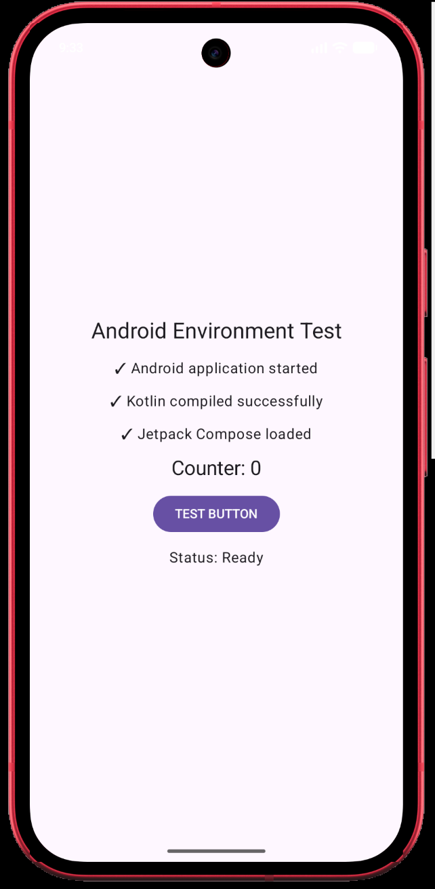

# TestProj — Android Environment Test

A deliberately minimal Android application built to validate the local Android
development pipeline end to end: Kotlin compilation, Jetpack Compose, Gradle
dependency resolution, debug APK generation, ADB device detection, APK
installation, application launch, and an instrumented UI test.

It is an **environment-validation project**, not a product. It contains no
databases, networking, authentication, background services, or third-party
frameworks.

---

## 1. What the app does

A single Compose screen displays:

```text
Android Environment Test

✓ Android application started
✓ Kotlin compiled successfully
✓ Jetpack Compose loaded

Counter: 0

[ TEST BUTTON ]

Status:
Ready
```

Pressing **TEST BUTTON** increments the counter (`Counter: 0` → `Counter: 1`,
and so on) and changes the status line to `Status: Test button works!`. The
status text is derived from the counter by a small pure function
(`statusForCount`) so it can also be unit-tested on the JVM.

| Item | Value |
| --- | --- |
| Project name | `TestProj` |
| Application name | `Android Environment Test` |
| Package / application ID | `com.onkar.androidtest` |
| Language | Kotlin |
| UI | Jetpack Compose (Material 3) |
| Build system | Gradle (Kotlin DSL) + Gradle Wrapper |
| Launcher activity | `com.onkar.androidtest.MainActivity` |
| minSdk | 26 |
| targetSdk / compileSdk | 37 |
| Permissions | none (no dangerous permissions requested) |

### App sample

<p align="center">
  
</p>

The screenshot was captured on the Pixel 10a emulator (Android 17 / API 37) in
the initial state: `Counter: 0` and `Status: Ready`. Once **TEST BUTTON** is
tapped, the same screen shows `Counter: 1` and `Status: Test button works!`.

---

## 2. Required tools

- JDK 17 or newer (verified with OpenJDK 25)
- Android SDK with:
  - `platforms/android-37.0` (install via `sdkmanager "platforms;android-37"`)
  - `build-tools;36.0.0`
  - `platform-tools` (provides `adb`)
  - an emulator + system image, or a physical device
- Gradle Wrapper is included (`./gradlew`). A local Gradle installation is not
  required.

`local.properties` must point at the SDK (this file is machine-specific and is
git-ignored):

```properties
sdk.dir=/home/mad_dog/Android/Sdk
```

`ANDROID_HOME` / `ANDROID_SDK_ROOT` may be used instead of `local.properties`.

The build also uses the current Android Gradle plugin conventions: AGP 9.x with
**built-in Kotlin** support (the `org.jetbrains.kotlin.android` plugin is
intentionally *not* applied) plus the Compose compiler plugin
(`org.jetbrains.kotlin.plugin.compose`).

---

## 3. Build

```bash
./gradlew clean
./gradlew assembleDebug
```

Other useful commands:

```bash
./gradlew testDebugUnitTest          # JVM unit tests
./gradlew lintDebug                  # Android lint
./gradlew assembleRelease            # signed release APK (see below)
```

### Release build and signing

`assembleRelease` produces `app/build/outputs/apk/release/app-release.apk`.
Signing credentials are **never committed**. They are read from the git-ignored
`local.properties`, or from environment variables with the same names:

```properties
# local.properties
release.keystore=/absolute/path/to/release.jks
release.keystore.password=<store password>
release.key.alias=<key alias>
release.key.password=<key password>
```

If `release.keystore` is not configured, `assembleRelease` still succeeds but
emits an unsigned APK that cannot be installed. To create a keystore:

```bash
keytool -genkeypair -keystore ~/.android/keystores/release.jks \
  -alias my-release -keyalg RSA -keysize 4096 -validity 10000 \
  -storetype PKCS12 -storepass '<password>' -keypass '<password>' \
  -dname "CN=My App, O=My Org, C=IN"
```

Verify a built release APK:

```bash
apksigner verify --verbose --print-certs app/build/outputs/apk/release/app-release.apk
zipalign -c -v 4 app/build/outputs/apk/release/app-release.apk
```

> Keep the keystore file and its password backed up outside this repository. If
you lose them you cannot ship updates for the same application ID.

## 4. Expected APK locations

```text
app/build/outputs/apk/debug/app-debug.apk        # debug-signed
app/build/outputs/apk/release/app-release.apk    # release-signed (see above)
```

## 5. Install on a connected device or emulator

```bash
adb devices
adb install -r app/build/outputs/apk/debug/app-debug.apk
```

If an older test build is already installed:

```bash
adb uninstall com.onkar.androidtest
adb install -r app/build/outputs/apk/debug/app-debug.apk
```

Verify installation:

```bash
adb shell pm list packages | grep com.onkar.androidtest
```

## 6. Run the app

```bash
adb shell am start -n com.onkar.androidtest/.MainActivity
```

## 7. Run the tests

Instrumented Compose UI test (requires a connected device/emulator):

```bash
./gradlew connectedDebugAndroidTest
```

JVM unit tests (no device required):

```bash
./gradlew testDebugUnitTest
```

The instrumented test (`app/src/androidTest/java/com/onkar/androidtest/MainActivityTest.kt`)
launches the real `MainActivity` and verifies that:

1. the app launches and the title is displayed,
2. all three environment-check lines are displayed,
3. the counter starts at `0` and the status is `Ready`,
4. the **TEST BUTTON** is displayed and can be clicked,
5. the counter becomes `1` (and `2` after a second click),
6. the status becomes `Test button works!`.

---

## 8. Connecting a physical Android phone

1. On the phone: **Settings → About phone → tap "Build number" 7 times** to
   enable Developer Options.
2. **Settings → System → Developer options → USB debugging → On**.
3. Connect the phone with a USB data cable.
4. Unlock the phone and accept the **"Allow USB debugging?"** RSA prompt
   (check "Always allow from this computer").
5. Verify:

   ```bash
   adb devices
   ```

   A usable device shows as `device`:

   ```text
   List of devices attached
   XXXXXXXXXXXX    device
   ```

   If it shows `unauthorized`, unlock the phone and accept the prompt again,
   then re-run `adb devices`. If it shows no entry, try a different cable/port
   and confirm `USB debugging` is enabled.

6. Install and launch as shown above.

## 9. Using an emulator

List existing AVDs:

```bash
emulator -list-avds
```

Start one (headless example):

```bash
emulator -avd <avd_name> -no-window -no-audio -gpu auto
```

Then wait for boot and run the tests:

```bash
adb wait-for-device
adb shell getprop sys.boot_completed   # prints 1 when booted
./gradlew connectedDebugAndroidTest
```

### Emulator notes for this machine

The tests in this README were verified on a Google Play x86_64 emulator
(`Pixel_10a`, Android 17 / API 37, 16 KB page size). Two environment quirks are
worth knowing about if you re-create an emulator here:

- The emulator can segfault in its bundled SwiftShader/ANGLE render path for
  several `-gpu` modes. If that happens, use `-gpu host` (with a window) or
  start the AVD from Android Studio's device manager.
- On the 16 KB page-size image, `vendor.uwb_hal` aborts repeatedly and init can
  set `sys.init.updatable_crashing=1`, which soft-reboots the framework until the
  AVD settles. `-feature -Uwb` suppresses the UWB aborts if you need it.

Neither affects the app or the tests.

### Pinned Espresso version

The Compose UI-test artifacts depend on `androidx.test.espresso:espresso-core`
3.5.0 transitively. That version uses hidden APIs (`InputManager.getInstance`)
that no longer exist on recent platform versions, which makes
`Espresso.onIdle()` throw `NoSuchMethodException` and fails every Compose test.
This project therefore pins `espresso-core` 3.7.0 explicitly in
`androidTestImplementation` (see `gradle/libs.versions.toml`).

---

## 10. Project layout

```text
TestProj/
├── app/
│   ├── build.gradle.kts
│   ├── proguard-rules.pro
│   └── src/
│       ├── androidTest/java/com/onkar/androidtest/MainActivityTest.kt
│       ├── main/
│       │   ├── AndroidManifest.xml
│       │   ├── java/com/onkar/androidtest/MainActivity.kt
│       │   └── res/values/{strings.xml,themes.xml}
│       └── test/java/com/onkar/androidtest/StatusLogicTest.kt
├── gradle/
│   ├── libs.versions.toml
│   └── wrapper/
├── build.gradle.kts
├── gradle.properties
├── gradlew / gradlew.bat
├── local.properties        (machine-specific, git-ignored)
├── settings.gradle.kts
└── README.md
```
